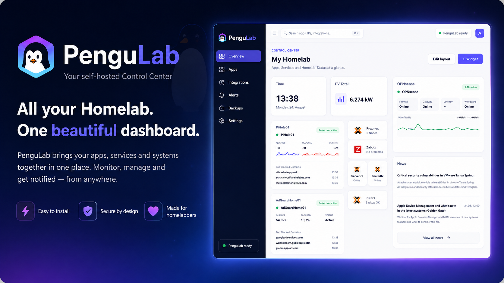
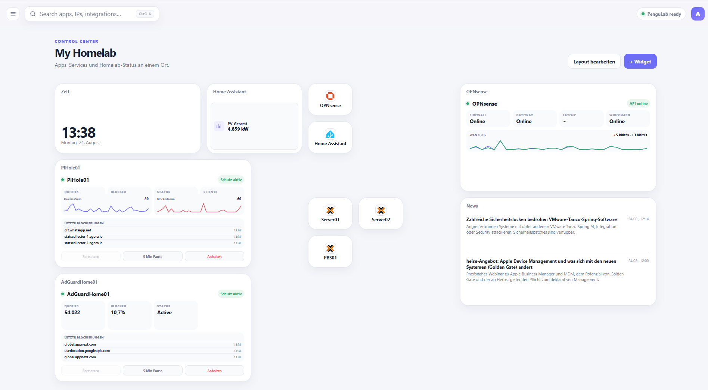
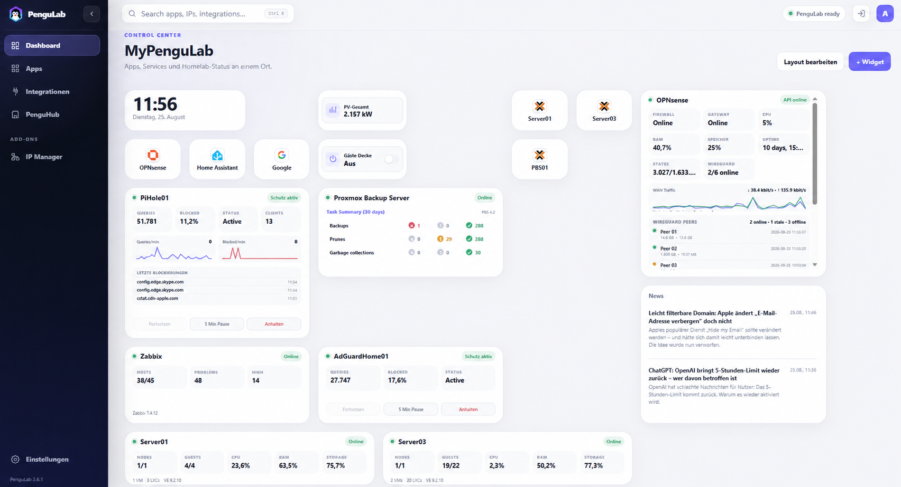
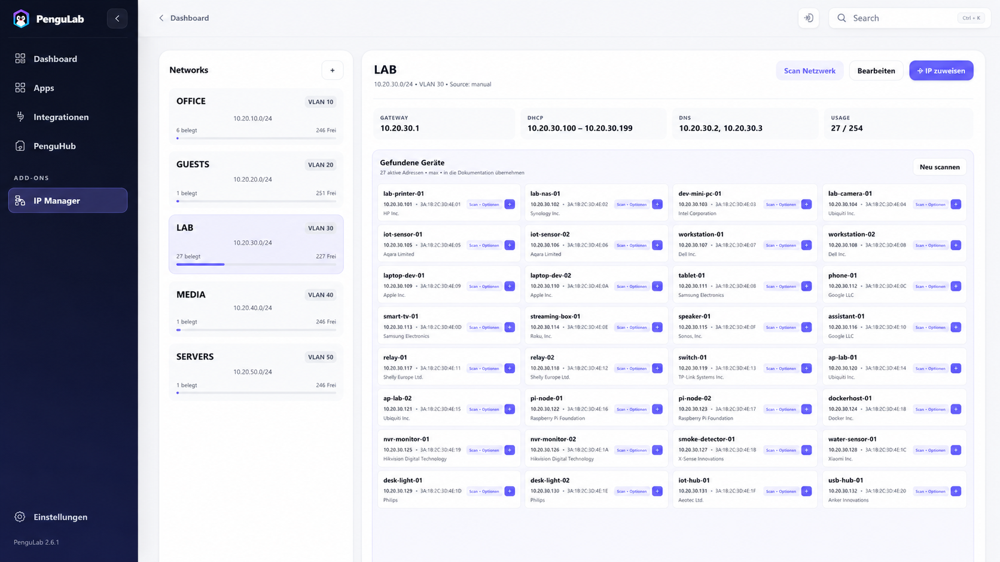

<p align="center">
  
</p>

# PenguLab

**All your Homelab. One beautiful dashboard.**

PenguLab is a self-hosted control center for your homelab. It brings your apps, services, integrations and important stats together in one clean dashboard.

It is built for people who want a fast overview, useful widgets and a setup that stays easy to manage.

## Why people like PenguLab

- **Unified overview** – keep your most important apps, widgets and services in one place.
- **Real-time monitoring** – view live values, status information and small charts at a glance.
- **Smart integrations** – connect tools like Pi-hole, AdGuard Home, OPNsense, NPMplus, Home Assistant, Proxmox VE, Proxmox Backup Server, Zabbix, Docker and Portainer through PenguHub.
- **Useful controls** – pause DNS protection or control selected Home Assistant entities right from the dashboard.
- **Free 8 px canvas layout** – move and resize widgets freely on desktop or iPad with the same 8 px magnetic snap horizontally and vertically; nearby tiles temporarily make room while dragging.
- **App groups** – drag one app onto another to create a compact iPhone/iPad-style folder and keep busy dashboards tidy.
- **Private by design** – your data stays on your own server.

## Overview

<p align="center">
  
</p>

## What you can add

PenguLab stays lightweight, but it can grow with your homelab through **PenguHub**.

Available integrations and add-ons include:

- Pi-hole
- AdGuard Home
- OPNsense — gateway, traffic, WireGuard, system resources, services and CARP/VIP status
- NPMplus — read Proxy Hosts and import selected entries as PenguLab apps
- Home Assistant
- Proxmox VE
- Proxmox Backup Server
- Zabbix
- Docker Engine
- Portainer
- RSS / Atom feeds
- IP Manager
- Generic JSON API widgets

Admins can also upload additional PenguHub integration packages as **ZIP files** directly in the web interface. Uploaded packages are stored in `/data/addons`, so they survive normal container updates. Only install packages from sources you trust, because an integration package may contain server-side code.

## NPMplus

The **NPMplus** integration reads Proxy Hosts through the NPMplus API and lets an administrator choose which hosts should become PenguLab apps. New apps can stay only in the app library, be placed on the dashboard individually, or be collected directly in one PenguLab app group. Existing matching apps are reused instead of duplicated, and later imports can update their target URL without overwriting your custom name, icon or category.

NPMplus authentication is performed server-side. PenguLab supports the current secure-cookie session flow as well as bearer-token responses used by older/upstream-compatible API versions.

## Proxmox Backup Server

The PBS integration uses a read-only API token and can show the familiar **Task Summary** for a selectable time window (7, 30 or 90 days): backups, prunes, garbage collection, syncs, verify jobs and tape backup/restore tasks with OK, warning and error counts.

For API-token authentication, use the PBS token ID (`user@realm!tokenname`) and token secret. A monitoring token needs appropriate read/audit permissions for the tasks it should see.

## Docker & Portainer

The **Docker Engine** integration provides a read-only dashboard view of containers, images and host resources through a remote Docker Engine API. Do not expose an unauthenticated Docker API directly to untrusted networks; use a protected TLS/reverse-proxy endpoint if you need direct Docker monitoring.

The **Portainer** integration uses a Portainer API access token and can summarize accessible environments, running containers and stacks. For many homelabs this is the easier way to monitor several Docker hosts from one PenguLab widget.

## Install with Docker

Create a new folder, add a compose file and start PenguLab.

```yaml
services:
  pengulab:
    image: ghcr.io/borderlane-ha/pengulab:latest
    container_name: pengulab
    restart: unless-stopped
    ports:
      - "19961:8080"
    volumes:
      - ./data:/app/data
```

Then run:

```bash
mkdir -p pengulab/data
cd pengulab
docker compose up -d
```

Open PenguLab in your browser:

```text
http://YOUR-SERVER:19961
```

## Install on Proxmox (LXC)

If you prefer Proxmox, use the included installer on your **Proxmox host**:

```bash
curl -fsSL https://raw.githubusercontent.com/Borderlane-HA/PenguLab/main/scripts/proxmox-lxc-install.sh -o /tmp/pengulab-lxc-install.sh
bash /tmp/pengulab-lxc-install.sh
```

The installer creates an unprivileged LXC, installs Docker and deploys PenguLab for you.

## Update PenguLab

### Docker

Open the folder that contains your `compose.yml` and run:

```bash
docker compose pull
docker compose up -d --remove-orphans
```

Your data stays in the mounted `data/` folder.

### Proxmox LXC

Open the LXC in the Proxmox console or enter it from the Proxmox host:

```bash
pct enter <CTID>
pengulabctl update
```

`pengulabctl update` creates a backup of the persistent PenguLab data before pulling and starting the new image.

If an older PenguLab LXC says `pengulabctl: command not found`, install/repair the helper once inside the LXC:

```bash
curl -fsSL https://raw.githubusercontent.com/Borderlane-HA/PenguLab/main/scripts/install-pengulabctl.sh | bash
```

## First login

A fresh installation starts with:

```text
Username: admin
Password: admin
```

Please change the password after your first login.

## Screenshots

### Dashboard

<p align="center">
  
</p>

### IP Manager

<p align="center">
  
</p>

## License

See [LICENSE](LICENSE).
